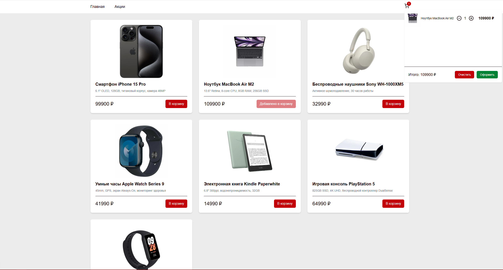

# Fullstack-приложение на React с Nextjs и Nestjs.

### Приложение интернет-магазина с frontend и backend-частью (в разработке).

Использовал: React, Nextjs, Tailwind, TanStack (React Query), Axios, Headless UI, Nestjs.

### Планирую добавить: БД, Dockerfile, ещё запросы, ещё frontend.

Запуск приложения:

Перейти в папку frontend и ввести команды:

```
npm install
npm run dev
```

Перейти в папку backend и ввести команды:

```
npm install
npm start (либо npm start:dev)
```

Frontend будет доступен по адресу:

```
localhost:3000
```

Swagger будет доступен по адресу:

```
localhost:5050/api#/
```

### Превью сайта


